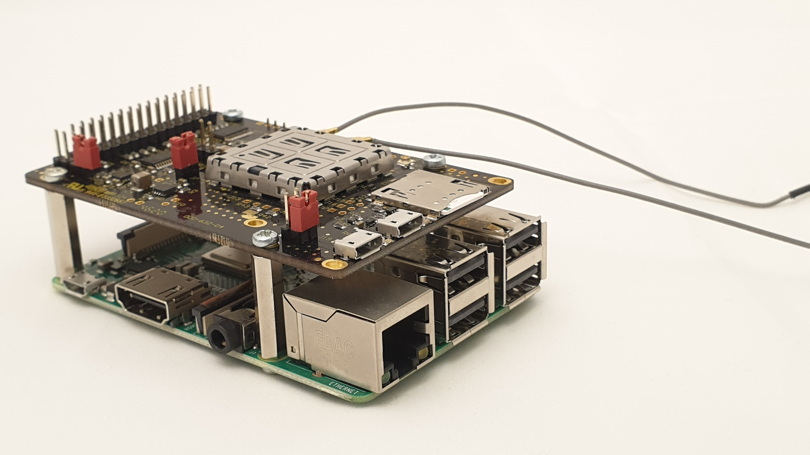
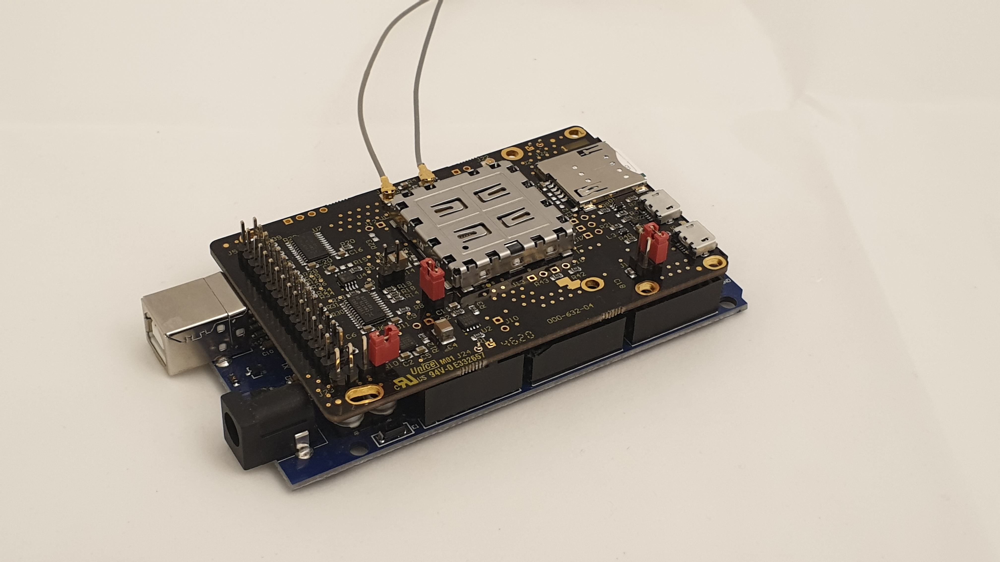

## Table of contents
{: .no_toc  }

{:toc}

## Summary

The WASP2 board is designed to be a general purpose demonstration platform for
 the Sierra Wireless CF3 format cellular modules.
 
It presents a subset of the CF3 interfaces to the end users via a
 30 way (2x15) 0.1" header. Some of the more commonly used interfaces are "level shifted"

 
 
## Technical information links

## ERRATA
The back of the PCB silkscreen legend has !ON and !WK - they are swapped - see the schematic diagram which is correct

## Host board Compatibility

PCs with USB 2.0 connectivity

Raspberry Pi 4 Model B 
Raspberry Pi 3 Model B+  
Raspberry Pi 3 Model B  
Raspberry Pi 2 Model B  
Raspberry Pi Zero W  
Raspberry Pi Zero  

Arduino Mega2560  
Arduino Uno  

  

  

[WASP2 Schematic diagram](./images/00063304_WASP2.pdf "WASP2 Schematic")

